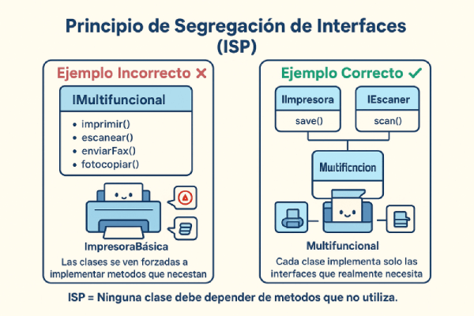

# Principio I: Segregación de Interfaces (ISP)

El principio de **Segregación de Interfaces** establece que los clientes no deben ser forzados a depender de interfaces que no usan. Es decir, es mejor tener muchas interfaces específicas que una interfaz general con muchos métodos.

---

## ¿Qué significa ISP?

- Los clientes no deben depender de métodos que no utilizan.
- Es mejor tener interfaces pequeñas y cohesivas que una interfaz "gorda".
- Cada interfaz debe tener una responsabilidad específica.

Este principio ayuda a evitar acoplamientos innecesarios y facilita el mantenimiento y la extensibilidad del software.

---

## Representación visual



---

## Ejemplo conceptual

Imagina un sistema donde tienes una interfaz `Worker` que incluye métodos para trabajar, comer y dormir. Un robot implementa esta interfaz pero no necesita comer ni dormir, por lo que debe lanzar excepciones o implementar métodos vacíos.

**Anti-patrón:**
```java
interface Worker {
    void work();
    void eat();
    void sleep();
}

class Robot implements Worker {
    public void work() { /* lógica */ }
    public void eat() { throw new UnsupportedOperationException(); }
    public void sleep() { throw new UnsupportedOperationException(); }
}
```

**Aplicando ISP:**
Para cumplir ISP, se deben separar las responsabilidades en interfaces específicas:

```java
interface Workable {
    void work();
}
interface Eatable {
    void eat();
}
interface Sleepable {
    void sleep();
}

class Human implements Workable, Eatable, Sleepable {
    // implementa todos los métodos
}
class Robot implements Workable {
    // solo implementa work()
}
```

Ahora cada clase solo implementa las interfaces que realmente necesita.

---

## Ventajas de aplicar ISP

- Reduce el acoplamiento entre clases.
- Facilita la implementación de interfaces específicas.
- Mejora la flexibilidad y mantenibilidad del código.

---

## Riesgos de no aplicar ISP

- Clases que implementan métodos que no necesitan.
- Acoplamiento innecesario entre componentes.
- Dificultad para mantener y extender el sistema.

---

## Ejemplos por lenguaje

Consulta los ejemplos prácticos en distintos lenguajes en la carpeta [`ejemplos`](./ejemplos/README.md).

---

## Recursos recomendados

- [Principio de segregación de la interfaz (wikipedia)](https://es.wikipedia.org/wiki/Principio_de_segregaci%C3%B3n_de_la_interfaz)
- [SOLID: Principio de Segregación de Interfaces](https://dev.to/victorpinzon198/solid-principio-de-segregacion-de-interfaces-1018)
- [Unleashing the Power of Interface Segregation: Building Flexible and Maintainable Software Systems](https://dev.to/tkarropoulos/unleashing-the-power-of-interface-segregation-building-flexible-and-maintainable-software-systems-2fgb)
- [Interface Segregation Principle (ISP): SOLID Principle](https://medium.com/@ramdhas/4-interface-segregation-principle-isp-solid-principle-39e477bae2e3)

---

> "Los clientes no deben ser forzados a depender de interfaces que no usan." — Robert C. Martin